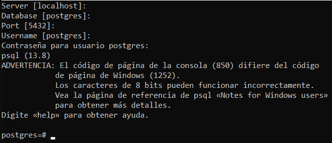

# POSTGRESQL

[Version en notion](https://www.notion.so/POSTGRESQL-9b67da34f42648d8ab605b40b8ff8aa1) 

- INTRODUCCIÓN
    
    “The World’s Most Advanced Open Source Relational Database”. **Es un motor de bases de datos.** 
    
    Existen 3 conceptos importantes en torno a la base de datos (la jerarquía de la base de datos se basa en estos elementos):
    
    - Lenguaje
    - Motor: El motor de base de datos es el que permite estructurar toda la información dentro de un servidor. Software que provee un conjunto de servicios encargados de administrar una base de datos.
    - Servidor: Computador que tiene un motor de base de datos instalado y en ejecución.
    - Base de datos: Grupo de datos que pertenecen a un mismo contexto.
    - Esquemas de base de datos en PostgreSQL: Grupo de objetos de base de datos que guarda relación entre sí (tablas, funciones, relaciones, secuencias).
    - Tablas de base de datos: Estructura que organiza los datos en filas y columnas formando una matriz.
    
    Open Source: tiene una comunidad de desarrolladores que constantemente agregan funciones a su núcleo.
    
    PostgreSQL usa como elemento principal de su núcleo el objeto relacional en las bases de datos. Es un concepto nuevo que pretende que las bases de datos tuvieran una estructura como la del desarrollo de programación orientada a objetos. El concepto arrancó siendo como una estructura en la cual las tablas pudieran relacionarse en torno a un concepto, de modo que tuviera información congruente.
    
    PostGIS: Servicio de geolocalización que permite hacer muchas funciones con respecto a mapas, puntos; el cuál te hace independiente a algún software de tercero.
    
    PL/PgSQL: te permite desarrollar código pero directamente en el lenguaje de PostgreSQL.
    
    Estandar ACID: es una cantidad de reglas que deben cumplir las bases de datos para tener buenas prácticas.
    
    - A: Atomicity - Atomicidad: tu puedes separar las funciones que estás desarrollando en la base de datos en pequeñas tareas y desarrollarlas como un todo, de modo que cuando ejecutas todas las tareas y terminan bien todas, la función termina okay, pero si alguna de ellas falla se deshacen los cambios de cada una de las que ya habían pasado.
    - C: Consistency - Consistencia: Todo lo que se desarrollo en torno al objeto relacional. Los datos tienen una congruencia entre sí.
    - I: Isolation - Aislamiento: Puedes tener varias tareas ejecutandose al mismo tiempo dentro de la base de datos. Puedes tener aisladas las funciones que se ejecutan dentro de la base de datos.
    - D: Durability - Durabilidad: Tener la seguridad de que la información no se va a perder en caso de un daño catastrófico.
    
    Por qué PostgreSQL:
    
    - Son Open source.
    - Integridad de datos.
    - Confían en PostgreSQL por el tipo de datos que usan
    - Concurrencia. Rendimiento.
    - Fiabilidad, recoperación ante desastres
    - Seguridad
    - Extensibilidad
    - Internacionalización, búsqueda de texto.
    - Por los servicios adiciones que ofrecen, como las PL/PgSQL.
    
    PostgreSQL está más estrechamente acoplado al entorno UNIX que algunos otros sistemas de bases de datos, utiliza las cuentas de usuario nativas para determinar quién se conecta a ella (de forma predeterminada). El programa que se ejecuta en la consola y que permite ejecutar consultas y comandos se llama psql, psql es la terminal interactiva para trabajar con PostgreSQL, es la interfaz de línea de comando o consola principal, así como PgAdmin es la interfaz gráfica de usuario principal de PostgreSQL.
    
- INTERACCIÓN CON POSTGRES DESDE LA CONSOLA
    
    Pasos para entrar a la consola:
    
    1. Buscamos la consola SQL Shell en la barra de inicio.
    2. Como no hay ninguna configuración extra de donde está postgre, presionamos enter
    3. Luego te pide el nombre de la base de datos. Como no hemos creado la base de datos, le damos enter
    4. El puerto tampoco fue cambiado, por lo que le damos enter otra vez.
    5. El Username, como no hemos creado ningún otro usuario, nuestro usuario es el predeterminado (postgres), por lo que volvemos a dar enter.
    6. Ponemos la clave que colocamos en la instalación (al escribir no se ve) y le damos enter.
    
    
    
    Comandos básicos: (\ se hace con Alt+92)
    
    - \h *nombre_de_la_funcion:* Ver cómo se ejecuta un comando SQL
    - Control + C: Cancelar todo lo que hay en la pantalla
    - SELECT version(); : Ver la versión de Postgres que está instalada
    - Ctrl + L: Limpiar pantalla de la consola PSQL
- INTERACCIÓN CON POSTGRES DESDE LA INTERFAZ GRÁFICA
    
    La interfaz de PgAdmin nos permite ver de manera grafica muchísima información referente a nuestras bases de datos.
    
    En Servers, si le damos clic derecho, podemos crear nuestra propia consulta de base de datos al servidor, pero con opciones nuevas propias de la interfaz grafica como definir un color de resaltado con el cual identificar nuestra consulta, y darle un nombre a nuestra conexión para identificarla. Ademas podemos al igual que con el Shell definir todas las opciones de conexión como el host, puerto, nombre de usuario, password, etc.
    
    La conexión en PgAdmin nos permite verla de manera grafica en forma de árbol donde tenemos en el primer nivel; las bases de datos, los usuarios que se pueden conectar a las mismas y los Tablespaces que son espacios físicos donde guardar nuestros datos.
    
    En la base de datos tenemos ademas un segundo nivel donde podemos ver todas las opciones que tiene nuestra base de datos y que en el shell tendríamos que visualizar y acceder a través de comandos:
    
    - Casts: Que es para hacer traducción de tipos de datos explicito.
    - Catalogs: Para catalogar la información, como una especie de subdirectorio de tablas.
    - Event Triggers: En un apartado donde podremos ejecutar funciones en base a acciones que pasan en la base de datos.
    - Extension: Nos servirá para instalar módulos desarrollados por terceros para nuestra base de datos.
    - Foreign Data Wrappers: Es acceso a base de datos remoto.
    - Languages: Hace referencia a los lenguajes de programación que puedes usar dentro de la base de datos.
    - Schemas: Nos permite ver la información propia de las tablas de nuestra base de datos. Es el más importante.
    
    Ademas PgAdmin nos permite ver en tiempo real informacion de lo que sucede con nuestra base de datos, al hacer clic en “Databases” nos mostrara en el panel a la derecha una ventana con distintas pestañas:
    
    - Dashboard: Nos muestra las conexiones simultaneas, las transacciones, lo que esta escribiendo, lo que esta leyendo, lo que esta borrando. En la parte inferior en “server activity” podemos ver las funciones que se estan ejecutando para la base de datos que estamos visualizando.
    - Properties: Nos muestra las propiedades de nuestra DB, como los tipos de datos, el dueño de la base de datos.
    - Statistics: Nos mostrara datos estadísticos de nuestra DB.
    - Dependencies: Nos enseña las dependencias que tenga nuestra base de datos.
    
    Tools: 
    
    [pgAdmin PostgreSQL Tools](https://www.pgadmin.org/)
    
    Pasos:
    
    1. Buscamos PgAdmin en el buscador de windows.
    2. seleccionamos la base de datos >Tools > Query Tool 
        
        Este Query tool es un editor de consultas SQL.
        
        Recomendable siempre usar el ;
        
    
- ARCHIVOS DE CONFIGURACIÓN
    
    Existen 3 archivos de configuración: (se pueden abrir con Visual Studio)
    
    1. Postgresql.conf : es el más importante y complejo de entender. En este archivo vamos a hacer registros de, por ejemplo, cuales son nuestras queries más lentas. La recomendación es leerse este documento.
        - Se encuentra la configuración de las replicas. Las replicas son servicios que permiten tener un respaldo de la información en tiempo real.
    2. pg_hba.conf : muestra los roles y los tipos de acceso que tiene a tu base de datos. Consiste básicamente en 5 columnas:
        - Una que te dice la fuente de la conexión.
        - Una que te dice qué acciones puede hacer
        - Una que te dice qué usuarios pueden conectarse.
        - Una que te dice la dirección de la que se están conectando.
            - Podemos hacer configuración de accesos remotos.
        - El método de autenticación.
            - md5 es un algoritmo muy sencillo de infiltración que recibe el texto que se le ponga, genera un montón de texto aleatorio que luego será contrastado con un mismo texto que esté dentro de la base de datos (para que otra persona no vea la contraseña).
        - Replicación: es el nombre que recibe la base de datos que está copiando los datos de la base de datos en tiempo real.
    3. pg_ident.conf: nos permite mapear usuarios. Permite a PostgreSQL decir qué usuario local del sistema operativo corresponde a qué rol de la base de datos.
    - SHOW config_file; : nos muestra donde están nuestros archivos de configuración.
- COMANDOS MÁS USADOS EN SQL
    
    Es importante siempre cerrar el comando con ;
    
    Comandos de ayuda (\ se hace con Alt+92):
    
    - \?: Como ver los comandos
    - \h: Ver todos los comandos SQL
        - También podemos buscar ayuda sobre una consulta específica poniendo \h *nombre_consulta*
    
    Comandos de navegación y consulta de información:
    
    - \c: Saltar entre bases de datos
    - \c *nombre_db:* Cambiar a otra base de datos
    - \l: Listar todas las bases de datos
        - Siempre van a haber instaladas 3 bases de datos cuando está configurado postgres de fábrica: postgres, template0 y template1
    - \dt: Ver las tablas de una base de datos. Listar las tablas de la base de datos.
    - \d *nombre_tabla:* Describir una tabla.
    - \dn : listar los esquemas de la base de datos actual.
    - \df: listar las funciones disponibles de la base de datos actual.
    - \dv: listas las vistas de la base de datos actual
    - \du: listar los usuarios y sus roles de la base de datos actual.
    
    Comandos de inspección y ejecución:
    
    - \g: Volver a ejecutar la función realizada anteriormente
    - \s: ver el historial de comandos ejecutados
    - \s <nombre_archivo> Si se quiere guardar la lista de comandos ejecutados en un archivo de texto plano
    - \i <nombre_archivo> Ejecutar los comandos desde un archivo
    - \e Permite abrir un editor de texto plano, escribir comandos y ejecutar en lote. \e abre el editor de texto, escribir allí todos los comandos, luego guardar los cambios y cerrar, al cerrar se ejecutarán todos los comandos guardados.
    - \ef Equivalente al comando anterior pero permite editar también funciones en PostgreSQL
    
    Comandos para debug y optimización:
    
    - \timing: inicializar el contador de tiempo para que la consola te diga en cada ejecución cuanto se demoró en ejecutar la función
        - Cuando lo activas saldrá: timing is on y poner la función a ejecutar. Al final te dice el tiempo que se tomó.
    
    Comandos para cerrar la consola: 
    
    - \q Cerrar la consola
    
    Las palabras reservadas de consultas SQL usualmente se escriben en mayúscula, ésto para distinguir entre nombres de objetos y lenguaje SQL propio, no es obligatorio, pero podría serte útil en la creación de Scripts SQL largos.
    
- TIPOS DE DATOS
    
    Principales:
    
    - Numéricos(Numeros enteros, Numeros Decimales, Seriales)
    - Monetarios(cantidad de moneda)
    - Texto(almacenar cadenas y texto, existen tres VARCHAR, CHAR, TEXT)
    - Binario(1 Y 0)
    - Fecha/Hora(Para almacenar Fechas y/o Horas, DATE TYPE, TIME TYPE, TIMESTAMP, INTERVAL)
    - Boolean(Verdadero o Falso)
    
    Especiales, propios de Postgres:
    
    - Geométricos: Permiten calcular distancias y áreas usando dos valores X y Y.
    - Direcciones de Red: Cálculos de máscara de red
    - Texto tipo bit: Cálculos en otros sistemas, ejm(hexadecimal, binario)
    - XML, JSON: Postgres no permite guardar en estos formatos
    - Arreglos: Vectores y Matrices
    
    [PostgreSQL data types, tipos de datos más utilizados - TodoPostgreSQL](https://www.todopostgresql.com/postgresql-data-types-los-tipos-de-datos-mas-utilizados/)
    
- TABLAS
    
    Son un elemento que contiene la información y la estructura en nuestra base de datos. A pesar de que tienen un funcionamiento complejo, las acciones que se pueden realizar sobre ellas son muy sencillas:
    
    CREATE: Inicializar la estructura de la tabla, sin ningún tipo de dato.
    
    ALTER: modificarla, agregar o eliminar columnas, agregar roles como propietarios de la tabla, cambiar índices, agregar llaves primarias, etc
    
    DROP: permite borrar la tabla con toda su información.
    
    Pasos para crear una tabla en PgAdmin:
    
    1. Servers > Databases > seleccionamos nuestra database > Schemas >Table > click derecho > create > table.
    2. Ponemos el nombre de nuestra tabla.
    3. Nos vamos a la pestaña Columns > click en el + >para poner la columna y el tipo de dato de cada columna.
    4. Recordemos que la mayoría de veces la llave primaria es id, y el Data Type es Serial porque es un valor secuencial.
    5. Hay que crear la llave primaria:
        1. Nos vamos a la pestaña Constraints > pestaña Primary Key > escribimos en Name: *nombredelatabla_pkey*
        2. save
    
    Pasos para crear el Script de inserción:
    
    1. Servers > Databases > seleccionamos nuestra database > Schemas >Table > click derecho sobre el nombre de nuestra tabla > SCRIPTS >INSERT Script.
        - Esta opción nos ahorra el tiempo de digitar el código para insertar datos
        - Como id (en este caso) es un campo que se va a ir actualizando automáticamente con cada insert, simplemente lo quitamos (tanto lo que dice id como el primer dato encerrado entre paréntesis).
- PARTICIONES
    
    Es una forma de separar físicamente los datos pero conserva la misma estructura lógica. Separación física de datos quiere decir que es posible guardar varias partes de la misma tabla en diferentes espacios de disco, e incluso en otros discos. 
    
    Internamente que es lo que hace: con el mismo nombre de la tabla asigna otras pequeñas tablas que tienen un rango definido.
    
    Pasos:
    
    1. Hemos terminado de crear las tablas. Vamos a simular que tenemos una tabla que tiene la información histórica de todos los viajes.
    2. Creamos esta tabla. La fecha va a ser el campo por el cual vamos a particionar la tabla.
    3. Tenemos que indicarle a la tabla que vamos a hacerla particionada y luego le vamos a decir cuál campo es: 
        1. En create table > Partition > le indicamos cual es el parámetro (partition type). En este caso va a ser por rango.
        2. En create table > General > Partitioned table? > Yes. Luego nos pide una llave para hacer la partición:
        3. En create table > partition > + > elegir el campo que nos va a crear la partición. En este caso elegimos como tipo de llave columna y la columna fecha. Esto quiere decir que vamos a crear varias tablas pequeñas que contienen diferentes rangos de fecha para guardar la información.
    4. Creamos la partición de la tabla ya creada
        
        
        
        
        
    
    No es posible crear llaves primarias en tablas particionadas, ya que la información está toda dividida. Normalmente el uso de las tablas particionadas  es para donde queramos guardar información en masa como bitácoras, y esta información debe hacer referencia a las tablas que si tienen las llaves primarias.
    
- ROLES
    - pueden crear y eliminar otros roles
    - Tienen atributos
    - Pueden ser agrupados bajo un conjunto global de permisos
    - Existen de manera predeterminada en Postgres
    - Los roles son independientes a una base de datos.
    
    Creando roles:
    
    1. nos vamos a la consola SQL Shell
    2. \h CREATE ROLE para ver cada una de las opciones
    3. CREATE ROLE *nombre_del_role* ; > si lo creamos así sería un role sin contraseña y con todas las características predeterminadas.
    4. ahora, queremos que este rol tenga la capacidad de acceder a la base de datos: 
        1. ALTER ROLE *nombre_del_role*  WITH LOGIN ;
    5. Si queremos modificarlo y crearle un superusuario, por ejemplo:
        1. ALTER ROLE *nombre_del_role*  WITH SUPERUSER ;
    6. Finalmente debemos asignarle una contraseña al usuario:
        1. ALTER ROLE *nombre_del_role*  WITH PASSWORD ‘*contraseña*’ ;
    7. Cuando volvamos a acceder a nuestra consola, le damos enter 3 veces y, cuando nos pida el nombre de usuario, ponemos el que creamos, enter y contraseña. Con esto accedemos al usuario que creamos.
    
    Borrando roles:
    
    1. Nos vamos a la consola SQL Shell
    2. Tenemos que entrar desde otro usuario porque no nos podemos borrar a nosotros mismos.
    3. DROP ROLE *nombre_del_role* ;
    4. \dg para verificar que fue borrado.
    
    Creando roles con PgAdmin:
    
    1. listado de la izquierda > Login/group Roles > click derecho > create - Login/Group Role
    2. General > escribir nombre. Si queremos le ponemos un comentario de lo que hace el role.
    3. Definition > ponemos la contraseña.
    4. Privileges > aquí es donde podemos ver todos los atributos de una manera más fácil de entender, a diferencia de la consola. Inherit rights from the parent roles es heredar los derechos del padre.
    5. Membership > quiere decir que ya hemos creado un grupo de permisos y podemos asignarlo a ese grupo de permisos.
    6. Parameters: podemos caracterizar variables y atributos que tiene ese usuario en la base de datos. Por ejemplo, podemos limitar la cantidad de memoria que va a usar la base de datos cuando este usuario se conecta.
    7. Security: tiene que ver con características o task de seguridad para agrupar los roles con respecto a un solo término.
    8. Le damos en guardar.
    
    Cómo hacer para que el rol que acabamos de crear pueda acceder a las tablas:
    
    1. Databases > buscamos nuestra base de datos > Schemas > Tables > click derecho > Grant Wizard
    2. Aquí nos va a preguntar qué tablas queremos afectar.
    3. Click en NEXT. Aquí seleccionamos los permisos que le queremos dar y el usuario
    4. Click en el + > elegimos el usuario y los permisos
    5. Click en NEXT >Va a ejecutar esto como un grupo de consultas, una tras otra.
    6. Click en FINISH
    7. Entramos a la tabla que elegimos y, en la pestaña SQL vemos que al final está el permiso cedido.
- LLAVES FORÁNEAS
    
    Corresponde a la relación que existe entre las tablas, y corresponde con nuestro ACID estándar en la parte de consistencia. Es decir, que todas las tablas tienen relación entre sí y que la información es congruente.
    
    Estructura:
    
    - Tabla de origen
    - Tabla de destino
    - Acciones en caso de que haya una modificación en la tabla de origen
    
    Paso a paso para relacionar tablas:
    
    1. Buscamos la tabla que queremos relacionar
    2. Click derecho > properties > Constraints > Foreign Key > + 
    3. Seleccionamos el nombre que le queremos poner a la llave foránea. De manera estandar siempre es el nombre de la tabla origen, luego nombre de la tabla destino y luego la palabra fkey (la tabla de origen es la tabla que tratamos de modificar).
    4. Una vez puesto el nombre le damos al lapiz para relacionar las columnas
    5. Pestaña Definition: 
        - Deferrable: la podemos aplazar
        - Deferred: que apenas la creemos no se va a validar
        - Match type SIMPLE: la comparación entre columnas va a ser simple (valor a valor). Si tenemos un parámetro especial tiene que ser compleja
        - Validated: tenemos que iniciar las tablas con la validación.
        - Auto FK index: Estpa deshabilitada de manera predeterminada porque no es un índice en nuestra tabla (ya creamos nuestra PK)
    6. Nos vamos a la pestaña Columnas
        - Local column: elegimos la columna de destino de la columna origen
        - References: elegimos la tabla a la que va a hacer referencia (la tabla de destino)
        - Referencing: elegimos la columna a la que vamos a hacer referencia en la tabla de destino.
        - En este ejemplo, estamos modificando la tabla trayectos.
        
        
        
    7. Le damos click en Add para que cree la relación
    8. Nos vamos a la pestaña Action. Es la más importante de todas porque con ella le decimos qué tiene que hacer la base de datos cuando ocurra un cambio en la tabla principal.
        - NO ACTION: No hacer nada
        - RESTRICT: Decirle a Postgres que no podemos permitir que la tabla cambie algo.
        - CASCADE: Si cambio la tabla de origen, la tabla destino tambien cambia.
        - SET NULL quiere decir que nuestra columna en esa fila va a dejar de tener por ejemplo el ID que tenia asociado un 77 y va a convertirse en NULL. Esto por que la tabla destino recibe un cambio y le decimos aPostgres que lo ponga en nulo.
        - SET DEFAULT: Si hay un cambio en la tabla origen nuestra tabla destino ponga un valor predeterminado. En un ejemplo un id podra quedar NULL.
    9. Nos vamos a la pestaña SQL para revisar nuestro código > save
- INSERCIÓN Y CONSULTA DE DATOS
    
    Insertar datos:
    
    1. click derecho en la tabla a la que queremos agregarle los datos > Scripts > INSERT Scripts
    2. Ingresamos los datos que queramos, teniendo en cuenta que los datos que pusimos como tipo de dato serial se llenan solos
    3. podemos dar click derecho > View/Edit data > all rows > para mirar la información de la tabla en otra pestaña
    
    Tips al insertar datos en una tabla de conexión:
    
    - La información de id que pongamos ya debe estar creada en la otra tabla. Si intentamos insertar datos que todavía no existen en las otras tablas, aparecerá error.
    - Si ya hemos insertado información en nuestra tabla de conexión y por alguna razón eliminamos esa información en la tabla principal, la información también se borrará automáticamente en la tabla de conexión, porque la hemos configurado desde el principio a que dependa de otras tablas.
    - Si actualizamos los datos en la tabla principal también se actualiza en las tablas remotas.
    
    Insertar datos masivos:
    
    1. Ingresamos a la siguiente página:
        
        [Mockaroo - Random Data Generator and API Mocking Tool | JSON / CSV / SQL / Excel](https://mockaroo.com/)
        
    2. Ponemos las filas que necesitemos con el tipo de dato que más se acerque (street address para las direcciones, por ejemplo)
    3. Eliminamos las columnas que no necesitemos
    4. Seleccionamos la cantidad de filas que queramos
    5. El formato es SQL porque queremos agregarlo directamente a la base de datos
    6. Ponemos el nombre de nuestra tabla
    7. Podriamos darle en PREVIEW y copiar y pegar el código en PgAdmin o descargar el archivo y copiar la información de ahí.
    8. Para asegurarse del formato estándar de nuestro SQL: 
        
        SELECT current_date; 
        
    9. NO podemos llenar las tablas de conexión con datos aleatorios. Tenemos que hacer una inserción masiva pero, en este caso, la condición es que las columnas que conectan con las tablas principales tengan valores que realmente existan.
    10. Lo podemos hacer con Mockaroo, pero marcando un límite que tome la información de las tablas principales.
    
    Cómo comenzar el serial desde cero: 
    
    TRUNCATE TABLE trayecto, viaje, estacion, viaje, pasajero RESTART IDENTITY;
    
- EJERCICIO
    
    Vamos a crear una estación de trenes. Objetos o instancias:
    
    - pasajero
    - Trayecto
    - estación
    - Tren
    - Viaje
    
    **Pasajero, Estación y Tren son objetos que van a existir, por lo que los podemos crear como tabla.**
    
    Procurar que, cuando vayamos a crear la base de datos, usemos o todos los nombres en singular o todos en plural.
    
    Ahora creamos las relaciones entre las 3 tablas creadas.
    
    El trayecto es la relación entre el tren y la estación.
    
    El viaje es la relación entre el trayecto y el pasajero.
    
    Cuando hemos terminado una estructura que creemos que está bien, podemos empezar a analizar el tipo de datos que queremos analizar.
    
    La estructura de la base de datos diseñada para el reto corresponde a los siguientes
    elementos:
    
    
    
    La base de datos se llama transporte, usaremos su esquema predeterminado public.
    
    El esquema public contiene las siguientes tablas:
    
    - Estación
    - Pasajero
    - Tren
    
    Y las tablas de relaciones entre cada uno de los elementos anteriores son:
    
    - Trayecto
    - Viaje
    
    El esquema relacional entre las tablas corresponde al siguiente diagrama:
    
    
    
    Estación
    Contiene la información de las estaciones de nuestro sistema, incluye datos de nombre con tipo de dato texto y dirección con tipo de dato texto, junto con un número de identificación único por estación.
    
    Tren
    Almacena la información de los trenes de nuestro sistema, cada tren tiene un modelo con tipo de dato texto y una capacidad con tipo de dato numérico que representa la cantidad de personas que puede llevar ese tren, también tiene un ID único por tren.
    
    Trayecto
    
    Relaciona los trenes con las estaciones, simula ser las rutas que cada uno de los trenes pueden desarrollar entre las estaciones
    
    Pasajero
    Es la tabla que contiene la información de las personas que viajan en nuestro sistema de transporte masivo, sus columnas son nombre tipo de dato texto con el nombre completo de la persona, direccion_residencia con tipo de dato texto que indica dónde vive la persona, fecha_nacimiento tipo de dato texto y un ID único tipo de dato numérico para identificar a cada persona.
    
    Viaje
    Relaciona Trayecto con Pasajero ilustrando la dinámica entre los viajes que realizan las personas, los cuales parten de una estación y se hacen usando un tren.
    
- SQL JOIN (EJEMPLOS)
    
    
    
    - pasajeros con al menos un viaje:
    
    
    
    - pasajeros que no han hecho ningún viaje (en la tabla de viajes no hay información de ese id)
    
    
    
    - 
- FUNCIONES ESPECIALES
    
    PostgrSQL tiene una lista de funciones especiales que te van a ayudar a crear tu aplicación mucho más rápido
    
    Funciones principales:
    
    - ON CONFLICT DO: Nos ayuda a solucionar problemas cuando queremos insertar o modificar datos en una tabla que no podamos y justamente después hacemos la actualización correcta. Es decir, si queremos insertar un dato que ya existe, esta función nos permite insertar si lo que queremos hacer es una actualización sobre el mismo dato.
    - RETURNING: nos permite devolver todos los cambios que hemos hecho sobre la base de datos. No es un deshacer los datos.
    - LIKE / ILIKE : nos sirve para hacer búsquedas al estilo de expresiones regulares donde podemos probar, por ejemplo, buscar nombres que empiecen y/o terminen por una letra. Like tiene 2 comandos o aributos:
        - % : uno o cualquier valor (caracter)
        - _ : solamente uno
        
        Tengamos en cuenta que la diferencia entre LIKE y ILIKE es que LIKE tiene en cuenta mayúsculas y minúsculas.
        
    - IS/ IS NOT: Nos permite comparar 2 tipos de datos que no sean estándar, como numérico o alfanumérico, sino que sean de tipo objeto o especiales como NULL. En este podemos saber, por ejemplo, si un campo es nulo o no lo es.
    
    Ejemplos:
    
    - El id 1 ya tiene información, pero queremos cambiarle tanto el nombre de la estación como la dirección de la estación. Si hacemos un INSERT nos saldrá error porque el id 1 ya existe, por lo que ponemos ON CONFLICT (columna_que_ya_existe) DO + lo que queremos hacer + SET nombre_de_columna_a_modificar = modificacion , nombre_de_columna_a_modificar = modificacion
        
        
        
    - En este caso, queremos agregar la siguiente información pero no sabemos cual es el siguiente id, por lo que ponemos RETURNING para que nos muestre la nueva fila que creamos con el id correspondiente y los valores que le pasamos. Es muy útil si estamos haciendo inserciones y queremos saber qué id fue el que creó sin tener que usar un SELECT después de este comando.
        
        
        
    - Aquí estamos buscando un nombre que empiece por la letra o minúscula.
        
        
        
- FUNCIONES AVANZADAS
    - COALESCE: te permite, por ejemplo, comparar 2 valores y retornar cual de los dos no es nulo
    - NULLIF: Te permite comparar 2 valores y retorna NULL si son iguales. Nos sirve para hacer comparaciones numéricas antes de hacer operaciones prohibidas.
    - GREATEST: Te permite comparar un arreglo de valores y te retorna el mayor
    - LEAST: Te permite comparar un arreglo de valores y te retorna el menor
    - BLOQUES ANÓNIMOS: al igual que el desarrollo de software te permite ingresar condicionales pero dentro de una consulta de bases de datos.
    
    Ejemplos:
    
    - Usamos COALESCE(nombre de la columna, valor a poner si es nulo) para reemplazar ese valor nulo por algo más.
    
    
    
    Si no queremos que nos cambie el nombre de la consulta:
    
    
    
    - nos retorna el valor más alto, es decir, 7
    
    
    
    - Estos son los bloques anónimos: En este ejemplo estamos poniendo una condición en la columna fecha de nacimiento, en donde se reemplaza la fecha por mayor o menor, según el caso.
    
    
    
    - Aquí creamos un código donde usamos la tabla pasajeros, creamos una nueva columna donde nos diga si es mayor o menor de edad, para las personas que tengan un nombre que empiece con la letra a o A
    
    
    
    
    
- VISTAS
    
    Sirve para no repetir la misma consulta muchas veces. Una vista en esencia es agarrar una consulta que tu repites mucho y convertirla en un solo nombre, porque nos ayuda a centralizar todos los esfuerzos en una sola función.
    
    Existen varios tipos de vistas:
    
    - Vista volátil: siempre que alguien consulta la vista la base de datos va a hacer la ejecución de la consulta en la base de datos, por lo cual siempre vas a traer información reciente.
    - Vista materializada: persistente. Solamente haces la consulta una vez y esta queda almacenada en memoria; la siguiente vez que se consulte te va a traer de memoria. Eso es bueno y malo si no sabes usarlo porque, cuando tenemos este vista, si no la actualizas podrías traer datos viejos que de pronto no te sirven. Esta vista es útil cuando quieres consultar datos de días anteriores
    
    pasos para hacer una vista volátil:
    
    1. Tenemos el código que queremos convertir en una vista
    2. Seleccionamos el código y lo copiamos
    3. Vamos al menú de la izquierda > views > click derecho > create > View
    4. En general: le ponemos el nombre que queramos
    5. Code: aquí pegamos el código que queremos que sea la vista
    6. En seguridad y SQL no hacemos ninguna modificación
    7. Click en save
    8. Para consultarla: SELECT * FROM *nombre_de_la_lista_creada ;*
    
    Pasos para hacer una vista materializada:
    
    1. Primero creamos la consulta (código)
    2. Seleccionamos el código y lo copiamos
    3. Vamos al menú de la izquierda > Materialized Views > Create > Materialized Views 
    4. En general: le ponemos el nombre que queramos
    5. Definition: aquí pegamos el código que queremos que sea la vista
    6. Storage: es importante que miremos el campo With data, que quiere decir si nosotros queremos llenar la vista materializada de una vez cuando la estemos creando o no. Si ponemos si, apenas le demos crear el hará la primero consulta de los datos.
    7. En Parameter y Security no hacemos nada.
    8. Click en guardar
    9. La primera vez que la vayamos a llamar (si en With Data lo dejamos en NO) nos va a salir un error, porque no tenemos datos, por lo que toca poner un REFRESH:
        
        REFRESH MATERIALIZED VIEW *nombre_de_materialized_view* ;
        
    10. Cuando hacemos alguna modificación en la tabla principal, a menos de que lo actualicemos (el código del paso 9) no va a actualizar esos datos.
    
- PL/SQL
    
    PLs o más conocidas en español como procedimientos almacenados también hacen parte del motor de Postgres y es tal vez una de las razones principales por las que las personas empiezan a usar este motor.
    
    Nos ayuda a desarrollar código directamente sobre la base de datos. Su estructura es sencilla: tiene una declaración, uso de variables, código y un fin; retorna o no retorna valores y se permite ejecutar dentro de la base de datos.
    
    Las PLs se componen de:
    
    - Nombres de funciones
    - Declaraciones
    - Bloques de código.
    
    Cómo crear una PL en Postgres usando código:
    
    - Un bloque de código se ejecuta con la palabra DO + función.
    - Si hacemos una consulta común con alguna condición que incluya comillas tendremos conflicto con las comillas de la consulta y las del DO, por lo que se usa el símbolo $$ para abrir y $$ para cerrar.
    - BEGIN para indicar que aquí comienza el bloque de código
    - END para indiciar que aquí termina el bloque de código.
    - RAISE NOTICE es mostrar la notificación.
    - Para hacer el bloque de código con uso de variables:
        - Estructura: DO + $$ + DECLARE + nombre de variable + tipo de dato + ; + BEGIN + … + END + $$
        - La sección DECLARE es la que nos permite agregar las variables
    - La mayoría de PLs tienen que ver con consultas. Esta es la principal función de una PL.
    - Si queremos asignar un valor de inicio en la función lo hacemos con := ; esto es, en el lenguaje de Postgres la asignación de variables. Usar solamente = está reservado para las consultas.
    
    
    
    - Para hacer modificaciones de variables dentro de las funciones podemos usar un contador de tipo integer, por ejemplo, el cual vamos a usar como si fuera un lenguaje de programación para contar todos los pasajeros que hay en la tabla.
    - Para llamar remotamente la función de PL tenemos que encapsular el bloque de código dentro de una función. Esto se hace de la siguiente forma:
        1. El DO lo convertimos en CREATE FUNCTION
        2. Escribimos el nombre de la función seguido de paréntesis ()
        3. Agregamos el RETURNS para indicarle qué tipo de valor retorna. Esto puede ser una variable, un tipo de dato, o nada (void)
        4. Hacemos la declaración del bloque de código diciendole que la función la identifique como lo siguiente (el bloque de código que hemos creado). Esto se hace escribiendo AS antes del bloque de código.
        5. Es indispensable que antes de terminar la ejecución de la creación de la función, le indiques al sistema qué tipo de lenguaje usa. Como el bloque de código es PL, el tipo de lenguaje sería PLPGSQL. Se puede escribir así o entre comillas.
            - Legunaje PL: PLPGSQL
            - Lenguaje SQL: sql
        6. Todo esto crea una nueva función en la lista de la izquierda.
        - Estructura: **CREATE FUNCTION + nombre de la función() +RETURNS + que tipo de valor retorna + AS +** $$ + DECLARE + nombre de variable + tipo de dato + ; + BEGIN + … + END + $$ **+ LANGUAGE + tipo de lenguaje +** ;
    - Para llamar la función: SELECT + nombre de la función + () + ;
        - En data Output no va a salir nada porque no hemos puesto a que retorne datos pero en Messages debería estar todo lo que estamos haciendo.
    
    Ejemplos:
    
    - Ejecutar un bloque de código que nos permite hacer algún tipo de modificación o ejecución (en este caso es escribir en la bitácora: ALGO ESTÁ PASANDO) sin necesidad de hacer una consulta.
        
        
        
    - Código con una variable llamada rec que nos permita recibir las filas de una consulta para mostrarlas en el NOTICE. En la parte BEGIN hacemos una consulta a una tabla (pasajeros) e insertamos cada uno de los datos en la variable llamada rec, y luego recorrerla para mostrar, en el LOG, cada uno de los campos de esa consulta.
        - FOR rec IN SELECT * FROM pasajeros LOOP: cada una de las filas de la tabla pasajeros va a quedar guardada en rec
        - Después del FOR, si ponemos: rec.nombre —> sería la forma que tenemos de acceder a la columna nombre de la fila que estamos viendo.
        - rec básicamente es una fila de la consulta que estamos haciendo
        - RAISE NOTICE ‘Un pasajero se llama %’ , rec.nombre ; : con esto estamos diciendole que escriba el log de notificaciones que un pasajero se llama
            - El % es un comodín para la función RAISE que puedas ingresar una variable externa, en este caso es rec.nombre, que entraría a reemplazar el % cada vez que se ejecute
        - END LOOP; : con esto terminamos el ciclo
        
        Al ejecutar esta función, debería mostrarnos en la parte de Messages cada uno de los nombres de los pasajeros.
        
        
        
    - Hacemos un contador de tipo integer que empiece en 0. Para cada uno de los registros en la tabla hacemos que contador sume 1. Con contador vamos aumentando el valor y luego mostramos en pantalla al final qué valor tiene
        
        
        
    - Este es el mismo bloque de código anterior pero encapsulandolo dentro de una función para poderlo llamar
        
        
        
    - El mismo código, pero que retorne un dato tipo integer. Como ya habiamos creado la función, simplemente hacemos la actualización de la función poniendo OR REPLACE después del CREATE. Con esto le decimos al sistema que si la función ya existe la reemplace, o sino la cree; Esto no va a funcionar si lo que estamos cambiando es los parámetros de la función o el tipo de retorno, por lo que debemos eliminar la función y volverla a crear.
        
        
        
    
    Cómo crear una PL en Postgres usando funciones de PgAdmin:
    
    1. Creamos el bloque de código como lo usamos en casos anteriores (la parte que abre y cierra con $$).
    2. Listado de la izquierda >base de datos > Schemas >public > functions > click derecho > create > Function
    3. Ponemos el nombre en General
    4. Definition > aquí ponemos el tipo de retorno
    5. Code > ponemos el bloque de código que queremos insertar. Podemos agregarlos sin los $$
    6. Options: Las predeterminadas nos funcionan, así que no tenemos que modificar nada.
        1. Volatility: es para mantener el cache de la función
        2. Returns a set: retorna un arreglo de datos
        3. Strict: si la PL está validando que los parámetros no vengan nulos
    7. Parameters: Aquí podríamos, por ejemplo, modificar la capacidad de memoria que queremos usar
    8. Click en guardar.
    9. Vemos en el listado de la izquierda que aparece la función que acabamos de crear.
    10. Si queremos llamarla podemos darle click derecho > Scripts > SELECT Script.
        1. Si el nombre de la función tiene mayúsculas la función va a ser llamada usando comillas dobles. Para quitar las comillas dobles tenemos que quitar todas las mayúsculas en el nombre de la función.
    
- TRIGGERS
    
    También conocidos como “Disparadores”. Son unas herramientas muy útiles que nos permiten ejecutar funciones dependiendo de acciones que se ejecuten sobre una tabla. 
    
    Acciones:
    
    - Insert
    - Update
    - Delete
    
    Los triggers tienen 2 variables globales muy importantes: 
    
    - OLD: lo que estaba antes del cambio. Si queremos que no haga el cambio y quedemos como estabamos, le ponemos RETURN OLD
    - NEW: es el cambio. RETURN NEW significa que le estamos confirmando al motor que el cambio puede proceder.
    
    Cómo concatenar nuestra PL a una función de Delete e insert (ejemplo):
    
    1. Debemos crear una pequeña tabla, la cual la vamos a modificar solamente usando la pl que acabamos de crear
    2. modificamos nuestra pl para que haga un insert en la tabla que acabamos de crear. Con esto tenemos la inserción en la tabla apasajeros cada vez que se ejecute esta pl
        
        
        
    3. Ahora ejecutamos la función:
        
        
        
    4. Con esto hecho se debió guardar información del conteo y la hora de ejecución en nuestra pequeña tabla hecha al inicio.
    5. Ahora vamos a hacer que la función sea de tipo trigger y en el paso 6 la adjuntamos a los eventos de INSERT de la tabla de pasajeros:
        1. Primero, tenemos que modificar el tipo de la función. La función no puede ser un RETURN integer porque esta no va a retornar ningún valor, por lo que la debemos cambiar a RETURN trigger porque va a ser un trigger. Al hacer esto tenemos que borrar la función y volverla a crear. Después quitamos el RETURN y también el mensaje que nos indica el nombre de los pasajeros, ya que solo necesitamos el contador.
            
            
            
            
            
        2. Como un trigger tiene información que se está cambiando, debemos confirmarle al motor de base de datos si el cambio se hace o no, por lo que debemos ponerle un RETURN antes del END. Para que la PL funcione correctamente tenemos que decirle que lo aceptamos es lo que estamos insertando
            
            
            
    6. Ahora la función solo retorna un TRIGGER, el cual podemos adjuntar a las acciones sobre una tabla. Las funciones sobre las que podemos adjuntar un TRIGGER son INSERT, UPDATE, DELETE y TRUNCATE. En este ejemplo vamos a hacerlo sobre el nivel de INSERT.
        1. Abrimos una pestaña nueva (Query Tool) > escribimos el código.
            1. BEFORE: si queremos insertar los cambios antes de que ocurran
            2. AFTER: después de la acción, en este caso es la inserción de pasajeros
            3. INSTEAD OF: hacer esta función en lugar de lo que la base de datos quería hacer. Reemplazar lo que se quería hacer en un principio.
            
            **CREATE TRIGGER + *nombre_del_trigger* + BEFORE, AFTER o INSTEAD OF + acción o función a adjuntar + ON + *nombre_de_la_tabla_principal* + FOR EACH ROW + EXECUTE PROCEDURE + *nombre_de_la_función + () + ;***
            
            
            
        2. Cuando hacemos esta ejecución debería quedar creada la conexión entre la pl, el trigger y la tabla.
    7. Vamos a probar insertando un valor en la tabla pasajeros y veremos como en la tabla que creamos en el paso 1 se verá el valor con la fecha. Esto quiere decir que los triggers están funcionando correctamente
- SIMULANDO UNA CONEXIÓN A BASES DE DATOS REMOTAS
    
    Postgres ofrece un servicio llamado . Esta función te permite conectarte a servidores remotos dentro de una consulta en el cual tu puedes hacer SELECT, una tabla local y hacer incluso un JOIN con una conexión a una base de datos remota.
    
    Crear una función de dblink:
    
    Vamos a conectarnos desde nuestra base de datos principal A a la base de datos remota B.
    
    1. Vamos a hacer el llamado de la función para revisar que esté instalada o no:
        
        SELECT * FROM + 
        
        dblink(’dbname=*nombre_db* 
        
        port=5432 
        
        host=127.0.0.1
        
        user = *usuario_con_el_que_vamos_a_acceder_remotamente*
        
        password=*la_de_siempre*’, +
        
        ‘consulta: SELECT *nombre_pk_tabla_remota*, *columna_tabla_remota* FROM *nombre_tabla_remota*’) + AS + *nombre_nueva_tabla* + (*primera_columna tipo_de_dato, segunda_columna tipo_de_dato* ) + ;
        
    2. Si sale error tenemos que instalarla: 
        
        CREATE EXTENSION dblink;
        
    3. Si sale que no tenemos permisos:
        1. click en la base de datos remota > Schema > Tables > click derecho > grant wizard > elegimos la tabla que necesitemos > next > + > elegimos el usuario con el que vamos a acceder remotamente > queremos que tenga todos los permisos > next > save
    4. Ahora si hemos traido datos de una base de datos remota a la cual no tenemos acceso directamente a su motor pero si a sus datos.
    
    Cómo cruzar la información con datos locales:
    
    1. Hacemos un simple JOIN:
        
        SELECT * FROM + *nombre_tabla_local +*
        
        JOIN + 
        
        dblink(’dbname=*nombre_db* 
        
        port=5432 
        
        host=127.0.0.1
        
        user = *usuario_con_el_que_vamos_a_acceder_remotamente*
        
        password=*la_de_siempre*’, +
        
        ‘consulta: SELECT *nombre_pk_tabla_remota*, *columna_tabla_remota* FROM *nombre_tabla_remota*’) + AS + *nombre_nueva_tabla* + (*primera_columna tipo_de_dato, segunda_columna tipo_de_dato* ) +
        
        ON + (*nombre_tabla_local.nombre_pk = nombre_nueva_tabla.pk*) + ;
        
    - Ejemplo de la conexión al revés (mostrando los datos de la base de datos principal que no pertenecen a la base de datos remota)
        
        
        
- TRANSACCIONES
    
    Las transacciones cumplen con el elemento A de acid que tiene que ver con atomicidad (hacer pequeñas tareas como un todo)
    
    Si queremos iniciar una transacción en la cual hay varias tareas que se ejecuten y si todas se cumplen vamos bien, y si no se devuelven todos los cambios se hace con BEGIN, COMMIT o  ROLLBACK 
    
    BEGIN: inicia el motor de base de datos diciendole que tenemos que hacer lo siguiente en una sola transacción.
    
    COMMIT: si llegamos al final guarde todos los cambios.
    
    ROLLBACK: si algo falló, devuelva todo lo que hicimos.
    
    Paso a paso:
    
    1. PgAdmin tiene esta opción de manera predeterminada. Quiere decir que todo lo que se ejecuta automáticamente agrega un commit al final, por lo que necesitamos desactivarlo si no queremos tener conflicto.
        
        
        
    2. BEGIN;
    3. SELECT cualquiera ;
        1. Se han activado 2 botones en la parte superior de PgAdmin: commit y rollback. Quiere decir que el ya sabe que tu comenzaste una transacción y todo lo que estás haciendo se está creando en memoria pero no se está ejecutando realmente en la base de datos.
            
            
            
    4. Si hacemos un INSERT y no hay error,sin el auto commit, la nueva información no debería aparecer en las tablas, esto quiere decir que la transacción se está haciendo correctamente. 
    5. Si ejecutamos el INSERT, esa transacción ya estará en memoria, por lo que podríamos hacerle un COMMIT o un ROLLBACK sin necesidad de darle play a todo el código.
    - Tengamos en cuenta que, si hacemos varias consultas y/o transacciones y alguna falla, no se va a ejecutar ninguna, así hallamos puesto un COMMIT y hará un ROLLBACK automáticamente, porque encerramos todo en una transacción.
- OTRAS EXTENSIONES PARA POSTGRES
    
    Todas las extensiones disponibles en PostgreS:
    
    [Appendix F. Additional Supplied Modules](https://www.postgresql.org/docs/11/contrib.html)
    
    Cómo instalar una extensión:
    
    1. Buscamos la extensión en el link de arriba
    2. Copiamos y pegamos el nombre principal de la función. Por ejemplo, para la función Leenshtein, es fuzzystrmatch.
        
        
        
        CREATE EXTENSION + paso 2 + ;
        
    
    Ejemplos:
    
    - Cómo activar una función que nos permite hacer la comparación entre 2 palabras, letra por letra, y cómo suenan cuando se pronuncian en ingles.
    - Función levenshtein: es una función creado por un matemático ruso en la que nos permitía conseguir un número donde sabíamos la diferencia entre 2 palabras. Al ejecutar la función nos muestra un número, que significa la cantidad de letras que hay que cambiar para que estas 2 palabras sean iguales
        
        
        
    - Función difference: es una función más avanzada que usa algorítmos de machine learning para la identificación de palabras cuando las pronuncias, por ejemplo, lenguaje natural, el micrófono de siri, etc. En este caso difference compara el sonido de 2 palabras dichas en inglés y nos dice de 0 a 4 que tán similares son, siendo 0 totalmente diferentes y 4 prácticamente iguales.
        
        
        
- BACKUPS Y RESTAURACIÓN
    
    pg_dump: para hacer copia de seguridad. 
    
    Backup information: 
    
    
    
    1. click derecho en nuestra base de datos > Backup
        1. Filename: nombre del archivo
        2. Format: Formato.
            1. Custom: formato único que usa postgres para guardar la información de la base de datos.
            2. Tar: Archivo comprimido que contiene la estructura de la base de datos.
            3. Plain: Es SQL plano. Tendremos las creaciones de la tabla, consultas, todo como si fuera una gran consulta de bases de datos.
            4. Directory: Tiene la estructura sin comprimir de la base de datos.
        3. Compression ratio: cantidad de veces que el ciclo de compresión se ejecuta sobre el archivo para que quede un archivo más pequeño.
        4. Encoding: La podemos dejar predeterminada (UTF8).
        5. Number of jobs: no lo podemos modificar porque esto lo decide PgAdmin. Normalmente asigna la cantidad de hilos que tiene el procesador.
        6. Role name: Quien va a ser el dueño del Dump.
    2. Click en el símbolo de carpeta para seleccionar donde queremos guardar nuestra base de datos.
    
    
    
    1. Backup
    
    Restore:
    
    1. Click derecho en la base de datos > restore
    2. Elegimos el formato con el que guardamos el backup
    3. Buscamos el backup en nuestros archivos y lo seleccionamos
    4. en Data/Objects tenemos las mismas opciones que cuando hicimos el backup
    
- MANTENIMIENTO
    
    Postgres maneja una serie de funciones que trabajan en segundo plano mientras que trabajamos directamente en la base de datos, y esto es a lo que le llamamos mantenimiento.
    
    El nombre más común de esto es Vaccum, ya que esto quita todas las filas y columnas e items del disco duro que no están funcionando, ya que postgres al percatarse de esto, las marca como “para borrar después”.
    
    Niveles de limpieza: 
    
    - Liviano, se ejecuta todo el tiempo en la DB en segundo plano.
    - Full o completo, que es capaz de bloquear las tablas para hacer la limpieza y luego la desbloquea. Una limpieza Full es importante porque puede que una tabla tenga problemas de indexación y se demore mucho en hacer las consultas.
    
    Hacer mantenimiento en DB no es lo mismo que hacerlo directamente en las tablas.
    
    Cómo hacer mantenimiento: 
    
    1. Click derecho en la base de datos > Maintenance.
    2. Aparecen 4 opciones principales: 
        1. VACUUM: La más importante.
            1. FULL: la tabla que vas a limpiar quedará limpia en su totalidad. Puede tumbar tu base de datos porque si la limpieza no ha terminado antes de que entre un nuevo dato, se congela y puede crear un bug
            2. FREEZE: Durante el proceso de limpieza la DB o tabla se va a congelar. Ningún proceso puede acceder a ella hasta que no termine el proceso de limpieza.
            3. ANALYZE: El más suave. Simplemente le dices al programa que ejecute una revisión pero que no la cambie. Te va a decir que tan bien o mal está la tabla o DB, y el índice de rendimiento.
        2. ANALYZE: No hace ningún cambio en la tabla. Solo hace la revisión y te dice como está la DB o tabla.
        3. REINDEX: Aplica para tablas que tienen índices entre ellos, las llaves primarias que los motores crean como índices porque son normalmente usados para búsquedas. Es importante porque tu puedes encontrar problemas cuando las tablas son muy grandes en lo que los índices son mucho más grandes que las tablas.
        4. CLUSTER: Es decirle al motor de base de datos que reorganice la información en el disco. No es recomendable.
    
    Es importante siempre hacer el mantenimiento en el horario en donde menos es utilizada la DB, ¿por qué? porque si hay menos tráfico los usuarios no van a sentir tanto la ausencia del servicio. Igualmente, en la medida de las posibilidades se puede usar una DB de respaldo para que el servicio no se vea ofuscado durante el mantenimiento, luego, una vez hecho el mantenimiento se puede actualizar la DB con los datos generados en la DB de respaldo.
    
- RÉPLICAS
    
    Son mecánismos que permiten evitar problemas de entrada y salida en los sistemas operativos.
    
    “Existen 2 tipos de personas, los que ya usan réplicas y los que las van a usar…”
    
    Piensa siempre en modo réplica y mucho más si estás comenzando tu proyecto.
    
    Las réplicas son la solución definitiva para los problemas de escritura y lectura.
    
    A medida que la DB crece encontraremos limitaciones físicas y de electrónica, si la DB aumenta tanto su tamaño, las limitaciones serán de procesamiento, RAM, almacenamiento.
    
    Hemos visto que las consultas en local son muy rápidas, sin embargo, cuando la aplicación ha sido desplegada pueden ocurrir multiples peticiones de lectura y escritura. Todos los motores de DB pueden hacer una ejecución a la vez, por lo que recibir tantas peticiones de consulta al mismo tiempo puede hacer que regresar una consulta se demore demasiado y eso puede ser catastrófico, pero las réplicas son la solución a este tipo de problemas.
    
    ¿Cuál es la estrategia? Tener una base de datos principal donde se realizan todas las modificaciones, y una base de datos secundaria dónde se realiza las lecturas. Separar las tareas es altamente beneficioso en cuanto al rendimiento de la aplicación, así, cuando se modifica una DB automáticamente se lleva el cambio a la DB de lectura. Todo lo que hay que hacer es configurar 2 servidores de postgres, uno como maestro y otro como esclavo. Se debe modificar la aplicación para que todas las modificaciones se hagan sobre el maestro y la lectura sobre la replica, o la DB en caliente. Es imposible realizar cambios en la DB de réplica.
    
    Creando réplicas en Postgres:
    
    1. Creamos el servidor aquí:
        
        [Cloudjiffy](https://app.cloudjiffy.co/)
        
    2. Click en Create New Environment > SQL > Postgres > la versión más reciente.
        1. En SQL Databases > Public IPv4 > ON Para que podamos conectarnos a ella a través del IP.
    3. Mientras se está creando procedemos a crear la segunda siguiendo los pasos 1 y 2 y cambiandole el nombre por esclava o réplica.
    4. Nos vamos a PgAdmin para agregar dos conexiones remotas: Click derecho en servers > Create > Server
        1. Nombre: MASTER
        2. Connection: estos datos de Username y Password nos llega por correo. La IP la sacamos de CloudJiffy, y el Puerto va a ser 5432
    5. Nos vamos a Cloudjiffy > Click en el servidor MASTER o principal > Click en config. Nos permite ver información de la base de datos. Buscamos el archivo postgresql.conf y lo abrimos. En este vamos a cambiar varios parámetros para que entienda que va a ser una base de datos de réplica y que va a recibir conecciones desde otra base de datos para copiar información. Buscamos:
        1. wal_level: quitamos el # antes. Es como la bitácora de la base de datos.
            1. wal_level = hot_standby
        2. max_wal_senders: quitamos el # antes. Corresponde a la cantidad de réplicas que vamos a tener.
            1. max_wal_senders = 2
        3. archive_mode: indica cómo vamos a guardar los archivos de esa bitácora.
            1. archive_mode = on
        4. archive_command: le indicamos un comando de linux que es para copiar archivos y dejarlos en una carpeta temporal
            1. archive_command = 'cp %p /tmp/%f’
    6. Click en SAVE
    7. Nos vamos a Cloudjiffy > Click en el servidor MASTER o principal > Click en config > Abrimos el archivo pg_hba.conf para agregarla entre la lista de servicios permitidos y evitar que la base de datos de réplica tenga que autenticarse.
        1. La ip es la ip de la réplica
        
        
        
    8. Tenemos que reiniciar el servicio. Click en el siguiente botón
        
        
        
    9. Nos vamos a Cloudjiffy > Click en el servidor SLAVE o el segundo > icono web ssh > tenemos que hacer un par de ajustes para que copie toda la información que ya está en el master para que inicie esa información desde lo que existe ya en master
        1. sudo service postgresql stop —> hace la copia de seguridad directamente a los archivos desde la master a la esclava. Con esto tenemos las dos en un estado idéntico.
        2. rm .rf/var/lib/pgsql/data/*  —> borramos todo lo que existe en nuestro archivo local
        3. pg_basebackup -U *usuario* -R -D /var/lib/pgsql/data/* —host=*ip_de_master* —port=5432 —> trae todo lo de master y lo inicializa como nuestra base de datos
    10. Nos vamos a Cloudjiffy > Click en el servidor SLAVE o el segundo > config > archivo postgresql.conf
        1. buscamos hot_standbay. Con esto le estamos diciendo a este postgres que su funcionamiento es como base de datos de réplica.
            1. hot_standby = on
    11. click en guardar
    12. Nos vamos a Cloudjiffy > Click en el servidor SLAVE o el segundo > icono web ssh
        1. escribimos  sudo service postgresql start —> con esto iniciamos el servicio de postgres de nuevo para que tome todas las modificaciones que hemos hecho.
- CAMBIAR NOMBRE DE TABLAS Y PARTICIONES
    
    Cómo cambiar el nombre de una tabla:
    
    
    
    1. el IF EXIST es por si queremos cambiar el nombre de una tabla y no sabemos si existe o no
    2. Cuando cambia el nombre de una tabla, PostgreSQL actualizará automáticamente sus objetos dependientes, como restricciones de llave foránea, vistas e índices, no hay afectación a los datos almacenados en la tabla.
    
    Revisar el PDF de cómo cambiar nombres de tabla para más información del renombramiento de tablas.